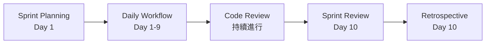
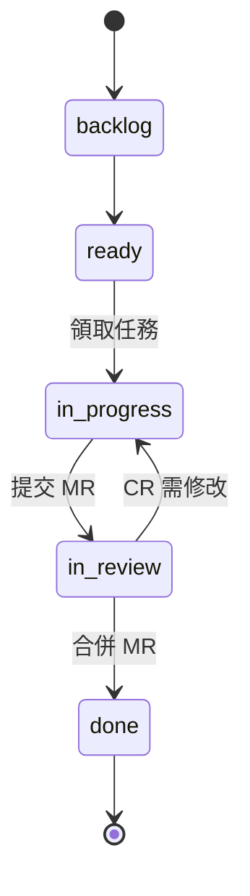

# Sprint 工作手冊

建立時間: 2026年6月11日 下午4:29

<aside>
🚀

**Sprint 工作手冊** — 商智中心團隊的 Scrum 實戰指南。

> 版本: 0.1.0 | 最後更新時間: 05/27/2026 | 最後更新人員: 許恩倫、陳泓毓
> 

• Git 協作教學 → [BIRC GIT 教學: 從建立專案到解決衝突](https://app.notion.com/p/BIRC-GIT-3429def5443d80d28ef2e1242380d6ce?pvs=21)
• GitLab 通用教學 → [GitLab 超詳細教學](https://app.notion.com/p/GitLab-37c9def5443d80469e1ae295e296e526?pvs=21)

</aside>

<aside>
📑

### 目錄

</aside>

---

# Scrum 概論

Scrum 將開發工作拆分為固定週期的迭代。

- 每 **2 週** 為一個 Sprint，包含固定的會議與流程。
- 透過持續交付與回顧，逐步改善產品品質與團隊效率。
- 每個 Sprint 分為：**計畫 → 執行 → 展示 → 回顧** 四個階段。

<aside>
💡

剛開始不需要理解所有細節，直接參與幾個 Sprint 就能掌握節奏。

</aside>

## 團隊角色

| Scrum 角色 | 團隊對應 | 職責 |
| --- | --- | --- |
| Product Owner (PO) | 團隊指定，可輪流 | 決定開發內容、排列優先順序、撰寫 User Story |
| Scrum Master (SM) | 由團隊取得Scrum Master證照的人員擔任或團隊指定 | 排除開發障礙、主持會議、確保流程運作 |
| Developer | 全體成員 | 技術實作、估算工作量、進行 Code Review |
- Product Owner (PO)
    
    
    | 時機 | 動作 |
    | --- | --- |
    | 隨時 | 建立 Issue + `kind::user-story`  • AC |
    | Planning | 說明 Story 價值、排優先順序 |
    | Review | 對照 AC 驗收功能 |
    
    <aside>
    ❌
    
    不可以自己 Approve 自己提的 MR。Sprint 中途不要塞新任務（緊急 Bug 除外）。
    
    </aside>
    
- Developer
    
    
    | 時機 | 動作 |
    | --- | --- |
    | Planning | 估點，加 `point::` 標籤 |
    | 開工 | `workflow::ready` → `in-progress` |
    | 完成 | 提 MR：`Resolve #IID ...` |
    | 合併後 | `workflow::done` |
- Scrum Master (SM)
    
    
    | 時機 | 動作 |
    | --- | --- |
    | Day 1 | 主持 Planning，建立 Milestone |
    | 每天 | 觀察 Issue Board，排除障礙 |
    | Day 10 | 產出 Sprint Report，主持 Review + Retro |
    | 結束 | 關閉 Milestone |
    
    <aside>
    ⏰
    
    in-progress > 3 天要追蹤；in-review > 1 天要提醒 Reviewer。
    
    </aside>
    

<aside>
⚠️

PO 與 SM 可由同一人兼任，但必須遵守：**PO 不得審查自己提交的 Merge Request**。

</aside>

## GitLab 功能對照

| Scrum 概念 | GitLab 功能 | 說明 |
| --- | --- | --- |
| Product Backlog | 未關聯 Milestone 的 Issue | 待辦清單 |
| Sprint Backlog | Milestone 下的 Issue | 當前 Sprint 工作項目 |
| Sprint | Milestone | 以 2 週為單位的開發週期 |
| User Story | Issue + `kind::user-story` | 使用者需求 |
| Task | Issue + `kind::task` | 技術任務 |
| Bug | Issue + `kind::bug` | 程式錯誤 |
| Story Points | `point::N` 標籤 | 工作量估算 |
| 看板狀態 | `workflow::` 標籤 | 進度追蹤 |
| Code Review | Merge Request | 程式碼審查 |
| DoD（完成定義） | MR 合併、AC 確認、`workflow::done` | 任務完成的判斷標準 |

## Sprint 流程圖



---

# Full Scrum Flow

> 這份 Playbook 帶你走完一個完整的 2 週 Sprint。每個步驟都有對應的詳細教學，遇到不確定的地方就往下翻。
> 

## Day 1（Sprint 第一天）

### 上午：Sprint Planning（60–90 分鐘）

- [ ]  SM 建立 Sprint Milestone（如尚未建立）
- [ ]  PO 介紹 Backlog 中的 Issue（優先順序已排好）
- [ ]  全員討論，挑選要做的 Issue 拉入 Sprint
- [ ]  對每個 Issue 估點（加 `point::` label）
- [ ]  確認總承諾點數合理（**首次建議 15–20 點**）
- [ ]  全員口頭承諾「這個量 OK」

### 下午：開工

- [ ]  每人挑一張 Issue
- [ ]  把 `workflow::` 從 ready 改為 in-progress
- [ ]  開 feature branch 開始寫 code

## Day 2–9（Sprint 進行中）

### 每天早上

- [ ]  發 Daily Standup 訊息（做了什麼 / 要做什麼 / 有無障礙）
- [ ]  檢查自己有沒有被 assign 為 Reviewer 的 MR

### 做完一張 Issue 時

- [ ]  提 MR（Title: `Resolve #IID ...`）
- [ ]  把 `workflow::` 改為 in-review
- [ ]  指定 Reviewer
- [ ]  等 Review 結果 → 修改 → re-review → Approve → Merge
- [ ]  Merge 後 `workflow::` 改為 done
- [ ]  拉下一張 Issue

### SM 每天做的事

- [ ]  掃一眼 Issue Board，確認沒有 Issue 卡太久
- [ ]  in-progress **> 3 天** → 問開發者是否需要幫助
- [ ]  in-review **> 1 天** → 提醒 Reviewer

## Day 10（Sprint 最後一天）

### 上午：Sprint Review（30–45 分鐘）

- [ ]  SM 事先產出 Sprint Report
- [ ]  展示數據：承諾達成率、週期時間、缺陷率
- [ ]  開發者逐一 Demo 完成的功能
- [ ]  PO 對照 AC 驗收
- [ ]  未完成 Issue 移除 Milestone，放回 Backlog
- [ ]  關閉 Milestone

### 下午：Retrospective（30 分鐘）

- [ ]  SM 引導三欄法：Keep / Problem / Try
- [ ]  每人至少寫 2 張
- [ ]  討論 → 選出 1–2 個行動項目
- [ ]  行動項目建成 Issue，排入下個 Sprint

## Sprint 結束後自我檢查

| 問題 | 回答 |
| --- | --- |
| 團隊能否自己建 Issue 並正確掛 Label？ | ✅ / ❌ |
| workflow:: label 有在每個階段被更新嗎？ | ✅ / ❌ |
| MR 都有經過 Code Review 才合併嗎？ | ✅ / ❌ |
| Sprint Report 能成功產出嗎？ | ✅ / ❌ |
| Retro 有產出具體行動項目嗎？ | ✅ / ❌ |

---

# Sprint Planning 計畫會議

在每個 Sprint 的**第一天**召開，確認未來兩週的開發目標與工作內容。

## 會前準備（PO）

1. 整理 Product Backlog，確保有足夠的 Issue
    - 每個 Issue 需標註 `kind::`（user-story, task, bug, spike）
    - 撰寫清楚的驗收標準（AC）
    - 使用 `priority::` 標記優先順序
2. 確認上個 Sprint 未完成的項目

## 會議流程（30~60 分鐘）

| 階段 | 時間 | 內容 |
| --- | --- | --- |
| 設定 Sprint 目標 | 10 分 | PO 說明核心目標，記錄在 Milestone Description |
| 挑選工作項目 | 20 分 | PO 介紹 Issue，團隊討論後納入 Sprint |
| 估算工作量 | 20 分 | 使用費氏數列（1, 2, 3, 5, 8, 13）加 `point::` 標籤 |
| 確認承諾 | 10 分 | 檢查標籤完整，Issue 改為 `workflow::ready` |

## 結束前檢查清單

- [ ]  已建立 Sprint Milestone 並設定起訖日期
- [ ]  Milestone Description 已寫入 Sprint 目標
- [ ]  所有相關 Issue 皆已關聯 Milestone
- [ ]  所有 Issue 都有 `kind::` 與 `point::` 標籤
- [ ]  總承諾點數符合團隊 Velocity（2 週約 **20–26 點**）

---

## 狀態流轉



---

# Code Review 規範

所有程式碼在合併到主分支之前，都必須經過**至少一位**成員審查。

## 審查重點

| 維度 | 關注重點 |
| --- | --- |
| 正確性 | 邊界條件、null 處理、計算錯誤 |
| 安全性 | SQL injection、敏感資訊外洩、權限控管 |
| 效能 | N+1 查詢、不必要的迴圈 |
| 可讀性 | 命名、函數長度、註解是否清晰 |
| 一致性 | API 設計、錯誤處理、回傳格式 |
- **必須修改 (Must Fix)**：明顯錯誤或風險，不修正不能合併
- **建議修改 (Should Fix)**：強烈建議調整，但不阻擋合併
- **風格建議 (Suggestion)**：由作者自行決定

## 合併條件

- [ ]  至少一位 Reviewer Approve
- [ ]  所有「必須修改」的意見都已解決
- [ ]  CI/CD Pipeline 測試通過
- [ ]  MR 標題包含 `Resolve #IID`
- [ ]  合併後 Issue 標籤改為 `workflow::done`

<aside>
🔒

**不可以**自己 Approve Merge自己的 MR。

</aside>

---

# Sprint Review 成果展示

Sprint 週期最後一天的**第一場**會議，展示過去兩週的開發成果。

> 根據Scrum.org的官方定義，Review為「對外展示」，可以在這個會議上與利害關係人進行「工作坊」形式的會議，任何人皆可針對目前的系統提出見解。
> 
- **承諾達成率（Say-Do Ratio）**：承諾點數 vs 實際完成點數
- **平均週期時間（Cycle Time）**：Issue 從開始到完成平均所需時間
- **缺陷率（Defect Rate）**：本 Sprint 中 Bug 所占比例

<aside>
💡

剛開始幾個 Sprint 的數據通常不太理想，這很正常。我們更重視**長期改善趨勢**。

</aside>

## 會議流程

1. **數據回顧**：SM 呈現 Sprint Report
2. **功能展示**：開發者逐一 Demo，PO 對照 AC 驗收
    
    **一個好的Demonstration流程**，可以參考:
    
    [一個好的Demonstration流程](https://hyc.eshachem.com/program/%e4%b8%80%e5%80%8b%e5%a5%bd%e7%9a%84demonstration%e6%b5%81%e7%a8%8b/)
    
3. **更新 Backlog**：未完成項目移回 Backlog，關閉 Milestone

---

# Retrospective 回顧

Sprint 最後一天的**第二場**會議。不看功能，只看「我們的作法可以怎麼改善」。

> 根據Scrum.org的官方定義，Review為「對內檢討」，任何人皆可以提出:
1. 已解決的問題 (讓其他人學習解決辦法，避免重蹈覆轍)。
2. 尚未解決的問題 (為什麼還沒解決?)。
3. 覺得**已經很好** / **可以更好**的地方。
> 

## Retro 規則

1. ✅ 對事不對人
2. ✅ 每個人都要發言
3. ✅ 行動項目必須具體可執行（不接受「大家注意一下」）
4. ❌ 不追究責任
5. ❌ 不離題討論技術細節（那是 Planning 的事）

---

# Story Points 點數規則

採用 **費氏數列（1, 2, 3, 5, 8）** 估算，綜合考量技術複雜度、風險與測試成本。

## 基準速率（Velocity）

| Sprint 長度 | 建議承諾點數 |
| --- | --- |
| 1 週 | 約 13 點 |
| 2 週 | 約 20–26 點 |

## 點數對照

| 標籤 | 特徵 | 範例 |
| --- | --- | --- |
| `point::1` / `point::2` | 極小修改、文字調整 | 修改 API 回傳文字 |
| `point::3` | 基礎 CRUD、簡單查詢 | GET /mine 分頁過濾 |
| `point::5` | 業務邏輯、狀態機、權限 | 活動審核通過邏輯 |
| `point::8` | 多模組連動、併發處理 | 取消報名自動遞補候補 |

<aside>
⚠️

若估點需要 **8 點以上（如 13 點）**，代表任務範圍過大，請在會議中拆成 2–3 個較小的 Issue。

</aside>

---

# Label 標籤規範

每個 Issue 至少包含：`kind::`（1 個）+ `workflow::`（1 個）。Sprint 任務另需 `point::` + `priority::`。

## kind:: — Issue 類型

| 標籤 | 使用時機 |
| --- | --- |
| `kind::user-story` | 使用者想要的功能或價值 |
| `kind::task` | 技術工作或維護 |
| `kind::bug` | 程式錯誤 |
| `kind::spike` | 需先技術調研才能估點 |

## workflow:: — 工作流狀態

| 標籤 | 意義 | 負責人 |
| --- | --- | --- |
| `workflow::backlog` | 待辦，尚未排入 Sprint | PO |
| `workflow::ready` | 就緒，可拉入 Sprint | PO |
| `workflow::in-progress` | 開發中 | Developer |
| `workflow::in-review` | 等待 Code Review | Reviewer |
| `workflow::done` | 已完成並通過驗收 | SM |

## priority:: — 優先等級

- `priority::critical` — 必須立即處理
- `priority::high` — 本次 Sprint 必須完成
- `priority::medium` — 盡量完成
- `priority::low` — 可延後

---

# 完成定義（DoD）

Definition of Done 是團隊對「什麼叫做完成」的共同標準。

## 一般完成標準

### 程式與行為

- [ ]  功能已完成，符合需求描述
- [ ]  沒有留下 TODO、debug code 或臨時繞法
- [ ]  命名與結構符合專案風格

### 品質與測試

- [ ]  相關測試已新增或更新
- [ ]  變更已通過本地驗證
- [ ]  修 bug 需確認原始問題不再出現

### 審查與合併

- [ ]  至少完成一次 Code Review
- [ ]  所有 review comment 已處理
- [ ]  MR 描述已寫出變更重點與驗證方式

### 後端 API 專案額外要求

- [ ]  Controller / Service / Repository 責任清楚分開
- [ ]  回傳格式符合 API 封裝規範
- [ ]  權限檢查符合角色定義
- [ ]  狀態變更對照活動狀態機

---

# Git Commit 規範（摘要）

本專案採用 **Conventional Commits**：

```jsx
<type>(<scope>): <subject>

Closes #123
```

| type | 說明 |
| --- | --- |
| `feat` | 新功能 |
| `fix` | 修 bug |
| `docs` | 文件 |
| `refactor` | 重構 |
| `test` | 測試 |
| `chore` | 雜項 |

Commit 前請執行 `./gradlew spotlessApply` 確保格式一致。

---

# 環境設定

## GitLab 權限

| 角色 | 最低權限 |
| --- | --- |
| 開發者 | Developer |
| PO / SM | Maintainer |

## GitLab 功能位置

| 任務 | 位置 |
| --- | --- |
| 查看 Issue | Plan → Issues |
| Sprint 待辦 | Plan → Milestones |
| 看板 | Plan → Issue Boards |
| Merge Request | Code → Merge requests |
| Wiki | Plan → Wiki |
| 管理標籤 | Manage → Labels |

## 建議看板設定

建立「Sprint Board」，依序加入 List：

`workflow::ready` → `workflow::in-progress` → `workflow::in-review` → `workflow::done`

---
